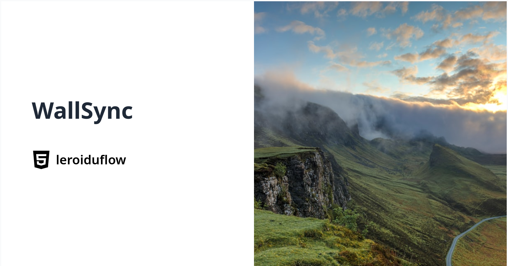

  

<h1 align="center">🎨 WallSync Megathread</h1>

🎨 I maintain WallSync — a huge megathread of wallpaper sites (anime, minimal, 4K, live, etc).
If you're into desktop customization, check it out or contribute!
Caution: Some websites may have ads; Use adblocker.

## How to Contribute?

If you want to suggest a resource or fix, feel free to open an issue or submit a pull request.  
Please follow these guidelines:  
- Provide a clear link and short description
- If anyone want to become collaborator, you can ask.  
- Ensure links are safe and relevant  
- Respect formatting for consistency
- Thank you for helping improve this project!

Help make this megathread better for everyone!

✨= My Favorite Places

🩷= For clean minds

### Summary
- [Recommended](#recommended-places)
- [Converter](#wallpaper-converter)
- [Reverse Image Search](#reverse-image-search)
- [Subreddits](#subreddits-wallpapers)
- [Anime](#anime-wallpapers)
- [Small](#small-places)
- [Specific](#specific-os)
- [Games](#games)
- [Apple](#apple-only)
- [Minimal](#minimalist-clean)
- [Scenic](#scenic-customizable)
- [Ghibli](#studio-ghibli)
- [Windows](#windows-wallpapers)
- [Live](#live-wallpapers)
- [Monitor](#multi-monitor)
- [Github](#github-pages)
- [Collections](#wallpapers-collections)
- [Telegram](#telegram-sources)
- [Linux/Desktop Environments](#linux--desktop-environments)
- [Other](#other-places)
- [Sources](#sources)

## 📂 Categories

### 🔍Recommended Places

- ✨ [Wallhaven](https://wallhaven.cc/) – Huge searchable database  
  ✨ [Downloader](https://github.com/eramdam/WallbaseDirectDownloader) – 4K download support  
- ✨ [AlphaCoders](https://alphacoders.com/) - Another big option. All platforms
- 🩷[SolidColor](https://www.solidbackgrounds.com/) - For enjoyers of empty backgrounds, Lots of colors options
- 🩷[Xmple](https://xmple.com/) - Abstract Vector + Solid colors wallpaper
- [WallpaperCave](https://wallpapercave.com/) – Community-contributed wallpaper database  
- [WallpapersCraft](https://wallpaperscraft.com/) – Mobile and desktop resolutions  
- [WallpaperAccess](https://wallpaperaccess.com/) - Mobile/Desktop  
- [WallpaperDen](https://wallpapersden.com/) - Good quality ,Resolution choice

### ⭕Wallpaper Converter

- ✨[Repallette](https://ziap.github.io/repalette/) - A lot of palettes conversion options.
- ✨ [Wallpaper theme converter](https://notneelpatel.xyz/WallpaperThemeConverter/) - Convert your wallpaper default palette into any palette you like.
- ✨[Wallrice](https://www.wallrice.xyz/) - Small utility to change palettes of your wallpaper.

### 🔄Reverse Image Search
- ✨[Search by Image](https://github.com/dessant/search-by-image) - Good addon to search images
- [Google Images](https://images.google.com/) ,[Bing Images](https://www.bing.com/images/) -  Images search
- [Yandex Images](https://yandex.com/images/) - Good reverse image search,sometimes better then google and bing.
- [Tineye](https://tineye.com/) - Good alternative, Can filter well.
- [Rev Wallpaper Search](https://we-img-search.ordinall.me/) – Reverse search engine for wallpaper sources , Steam-Only

### ✨Subreddits Wallpapers

- [r/WallpaperRequests](https://www.reddit.com/r/WallpaperRequests/) – Request custom wallpapers  
- [r/AmoledBackgrounds](https://www.reddit.com/r/Amoledbackgrounds/) - Amoled Backgrounds  
- [r/Wallpaper](https://www.reddit.com/r/wallpaper/), [2](https://www.reddit.com/r/wallpapers/) – General wallpaper sharing community
- [r/WallpaperDump](https://www.reddit.com/r/wallpaperdump/) - Collections wallpapers  
- [r/MobileWallpaper](https://www.reddit.com/r/MobileWallpaper/) - For mobile devices
- [r/phonewallpapers](https://www.reddit.com/r/phonewallpapers/) - For mobile
- [r/iWallpaper](https://www.reddit.com/r/iWallpaper/) - For mobile devices
- [r/iphonewallpapers](https://www.reddit.com/r/iphonewallpapers/) - For mobile devices (iphone specifically)
- [r/LivingBackgrounds](https://reddit.com/r/LivingBackgrounds) – Community of live wallpaper fans  
- [r/MultiWall](https://www.reddit.com/r/multiwall/) - Community for Monitors wallpapers
- [r/WidescreenWallpapers](https://www.reddit.com/r/WidescreenWallpaper/) - Widescreen
- [r/animewallpaper](https://www.reddit.com/r/Animewallpaper/) - Community for anime wallpapers , all platforms, Have NSFW images⚠️

### 🐉Anime Wallpapers

- ✨ [Anime Pictures](https://anime-pictures.net/) – High-quality 4K anime wallpapers  
- [WallpaperWaifu](https://wallpaperwaifu.com/) – Anime-style wallpapers and packs  
- [TheOtaku](https://theotaku.com/wallpapers/) – Anime fanart, wallpapers, and profiles  
- [HaoWallpaper](https://haowallpaper.com/) - Chinese wallpapers , Use Translation

### 🐭Small Places

- 🩷[ColorKit](https://colorkit.co/solid-color-wallpapers/) - 300 solid colors backgrounds , choice of size , 4K
- [Solarized Wallpapers](https://github.com/visika/solarized-wallpapers) - Solarized repo  
- [ArchMinimal](https://github.com/LagrangianLad/arch-minimal-wallpapers) - Few wallpapers  
- [Debian-HD](https://github.com/UncleSpellbinder/Debian-HD-Wallpaper) - 5 images, 4K   
- [Ozan_1327 YouTube](https://www.youtube.com/@ozan_1327/videos) - 5 videos, live wallpapers
- [Wallpaperxverse](https://t.me/s/wallpaperxverse) - Telegram channel, few wallpapers, phone only

### 🖼️Specific OS  

- [Chromecast Backgrounds](https://chromecastbg.alexmeub.com/) – Google Chromecast photo backgrounds
- [ChromeOS](https://www.androidpolice.com/chromebook-chrome-os-wallpapers/) - Chromebook/ChromeOs official wallpapers  
- [Xbox Wallpapers](https://www.xbox.com/en-us/wallpapers/) – Xbox-themed high-res wallpapers  
- [PlayStation Wallpapers](https://www.playstation.com/en-us/wallpapers/) - PlayStation-theme high res wallpapers  
- [SteamDeck Wallpapers Archive](https://archive.org/details/SDDesktopWallpaper) - Archive of SD desktop mode  

### 🎮Games
- [Minecraft](https://www.minecraft.net/en-us/collectibles?tabs=%7B%22tab%22%3A0%7D) - Official
- [LOL](https://lolwallpapers.net/) - Unofficial
- [Valorant](https://playvalorant.com/en-us/media/) - Official
- [Genshin Impact](https://www.hoyolab.com/article/383753) , [2](https://www.hoyolab.com/topicDetail/147423) , [3](https://drive.google.com/drive/folders/10ulrhy1E74FGjoGuiF1YX1n9mOwoyfSy) , [4](https://hoyo.global/art-gallery/official-artwork/#!) , [5](https://hoyo.global/art-gallery/) - Official
- [Overwatch](https://overwatch.blizzard.com/en-us/media/) - Official
- [CKprojektRed](https://press.cdprojektred.com/en#media) - Official
- [SteamGridDB](https://www.steamgriddb.com/) - Unofficial , assets from steam games
- [Cyberpunk](https://www.cyberpunk.net/ca/en/cyberpunk-2077#media) - Official

### 🍎Apple Only

- [Mac Walls](https://goo.gl/photos/HjY1hmo6p3jfFz8a7) – Apple-inspired designs  
- [BasicAppleBlog Wallpapers](https://basicappleguy.com/basicappleblog/category/Wallpaper) – Custom iOS/macOS style wallpapers  
- [Applescoop](https://applescoop.org/wallpapers/) - For iPhone  

### ⚪Minimalist Clean
- ✨[Minimalistic Wallpapers](https://minimalistic-wallpaper.demolab.com/) – Dynamic minimalist wallpaper 
- [Simple Desktops](https://simpledesktops.com/) – Minimalist one-object wallpapers
- [Positron Dream](https://www.positrondream.com/) – Minimalist and clean aesthetics  
- [SetAsWall](https://www.setaswall.com/) – Multiple style categories with simple UI, good quality  

### 🌄Scenic Customizable

- [Scenic Illustrations](https://www.pixeltrue.com/scenic-illustrations) – Custom landscape artwork  
- [CoolBackgrounds](https://coolbackgrounds.io/) – Generate abstract backgrounds and gradients  

### 🎬Studio Ghibli

- [Studio Ghibli Official](https://www.ghibli.jp/info/013772) – Official wallpapers from Studio Ghibli , Use translation if needed 
- ✨ [Ghibli Upscaled](https://rentry.co/FMHYBase64#ghibli-upscaled) – 4K upscaled versions of Ghibli artwork , [Base64](https://www.base64decode.org/)

### 🪟Windows Wallpapers

- ✨ [Ultimate Windows Wallpack](https://rentry.co/fmhybase64#windows-wallpapers) – 4K Windows wallpapers , [Base64](https://www.base64decode.org/)
- [VSThemes](https://vsthemes.org/en/) – Windows visual styles and wallpapers  
- [Windows Wallpaper Wiki](https://windowswallpaper.miraheze.org/wiki/Main_Page) – Community-curated collection  
- [Windows Spotlight Archive](https://windows10spotlight.com/) – Daily Windows lock screen wallpapers  
- [Bing Wallpaper Archive](https://bingwallpaper.anerg.com/) – Daily Bing wallpapers archive  
- [Microsoft Design Wallpapers](https://microsoft.design/wallpapers/) - Official from Microsoft  
- [WallpaperHub](https://www.wallpaperhub.app/) - Official Windows Wallpapers Collections  

### 🎥✨Live Wallpapers

- [Motion](https://motionbgs.com/) - Desktop/Mobile format , Good quality
- [Space](https://www.wallpaperengine.space/) - Wallpaper Engine wallpapers
- [WALLegend](https://wallegend.net/en/) – High-quality live wallpaper packs  
- [MoeWalls](https://moewalls.com/) – Anime and aesthetic live wallpapers  
- [Balu - 4K Nature Live Wallpapers](https://www.youtube.com/@BaluRelaxingNature/videos)  - Good quality, Nature
- [Primal Earth](https://www.youtube.com/@primalearth8951/videos) - Good quality, Beautiful Places of Earth
- [Pixground - Live Wallpapers](https://www.youtube.com/@Pixground/videos)  - Good quality, AI
- [HypnoRimaVisuals - Visual Effects Wallpapers](https://www.youtube.com/@HypnoRimaVisuals/videos)  
- [Cosmic Orion - Live Wallpapers](https://www.youtube.com/@4KLiveWallpapers/videos)  
- [MyLiveWallpapers](https://mylivewallpapers.com/) – Anime live wallpapers  
- [DesktopHut](https://www.desktophut.com/) - Live Wallpapers, Cross-Platform
- [Wallsflow](https://wallsflow.com/) - Desktop only, Ask to disable adblocker, 15 seconds waiting
- [Wallshub](https://wallshub.com/) - Desktop only, 60 seconds waiting  

### 👥Multi-Monitor

- [DualMonitorBackgrounds](https://www.dualmonitorbackgrounds.com/) – Wallpapers for dual monitor setups  
- [WallpapersWide](https://wallpaperswide.com/) - Wide wallpapers, choice of resolution  
- [WallpaperFusion](https://www.wallpaperfusion.com/) - For multiple monitors
- [UltraWideWallpapers](https://ultrawidewallpapers.net/)- Ultrawide wallpapers, Resizable for any device  

### ✨🐱GitHub Pages

- [GruvboxWallpapers](https://gruvbox-wallpapers.pages.dev/) - For Gruvbox Fans  
- [NordBackgrounds](https://github.com/dxnst/nord-backgrounds), [Nord Wallpapers](https://github.com/TheGlitchh/Nord-Wallpapers/tree/master/wallpapers) - For Nord Fans  
- [Aesthetic Wallpapers](https://github.com/D3Ext/aesthetic-wallpapers) – Curated aesthetic wallpapers, Web-App available  
- [Dracula Wallpapers](https://github.com/dracula/wallpaper), [Helpotters Dracula Wallpapers](https://github.com/helpotters/dracula-wallpapers) - For Dracula Fans  
- [Catppuccin Wallpapers](https://github.com/orangci/walls-catppuccin-mocha) , [2](https://github.com/ashish0kumar/windots/tree/main/walls) - For Catppuccin lovers  
- [Onedark Wallpapers](https://github.com/Narmis-E/onedark-wallpapers) - Only Onedark wallpapers  
- [TokyoNight Wallpapers](https://github.com/tokyo-night/wallpapers) - For TokyoNight fans  
- [Walls Collections](https://github.com/orangci/walls), [2](https://github.com/dharmx/walls) , [3](https://github.com/orangci/walls) - Random Collections
- [Wallpapers Collection](https://github.com/JoydeepMallick/Wallpapers) -Big collection made by someone + link to ressources
- [AI](https://github.com/Schneegans/ai-wallpapers) - Wallpaper made by midjourney+upscaled 

### 📖Wallpapers Collections

- [GetWallpapers](https://getwallpapers.com/), [WallpaperTag](https://wallpapertag.com/) , [Dog](https://wallpaper.dog/) - Collections of wallpapers, multiple options
- [RareGallery](https://rare-gallery.com/) - Offer for live, phone/desktop
- [lwallpapers](https://wallpaper.castorisdead.xyz/) - Collection of 900 desktop wallpapers , preview+download  
- [Wallpapers GitLab](https://gitlab.com/dwt1/wallpapers) - GitLab collection
- [Mix](https://photos.app.goo.gl/h2eM1Bw1xGomqXmt9), [2](https://drive.google.com/drive/folders/0B-9Li62rpt59dXYtNmhVRFRnaXc?resourcekey=0-_YwGtwDOc3jMCaP5grgS9w&usp=drive_link) - Google Photos Collection  

### 💬Telegram Sources
  
- [Catppuccin Wallpapers](https://t.me/catppuccinwallpapers) - Reuploads of the GitHub repo  
- [BestWallpapers](https://t.me/s/bestwallpapes) - Collection of Wallpapers  
- [WallpapersCentral](https://t.me/wallpaperselection) - Official Wallpaper Selection Telegram, Mobile/Web
- [Deer](https://t.me/wpr_13) - Wallpapers PC/Phone , nature + aesthetic 
- [Amoled](https://t.me/amoledwallpapers) - Amoled wallpapers , only phone
- [WallpaperHeaven](https://t.me/wallpaper_heaven19) - all devices
- [AHSRIR](https://t.me/animewallpapers106) - Anime , phone only
- [G_Walls](https://t.me/G_Walls),[DropMyWall](https://t.me/dropmywall), [Iconic](https://t.me/IconicWallpaperPremium),[Wallpapers](https://t.me/wall69papers),[Phones](https://t.me/New_4K_Wallpapers) - 4K, phone-only 
- [ImanCraft](https://t.me/imancrafft) - islamic wallpapers, phone only
- [DesktopWallpapers](https://t.me/desktopwallpapers) - For desktop only  

### Linux / Desktop Environments 

- ✨ [Distros Wallpapers](https://github.com/LinuxKits/Distro-wallpapers),[2](https://github.com/George443001/Distro-wallpapers) - Unofficial, but most are here, Fork added new versions.
- [Awesome-Wallpapers](https://github.com/dpejoh/awesome-wallpapers) , [Phone](https://github.com/dpejoh/phone-wallpapers) - Good quality, no updates since few months
- [Archcraft Wallpapers](https://github.com/archcraft-os/archcraft-wallpapers) - Official repo  
- [Arch Linux Wallpapers](https://archlinux.org/packages/extra/any/archlinux-wallpaper/) - Official from packages
-  ✨[Archpapers](https://github.com/connorslade/ArchPapers) - Unofficial CLI tool to create your own arch wallpaper 
- [CachyOS Wallpapers](https://github.com/CachyOS/cachyos-wallpapers) - Official repo
- [Cosmic](https://github.com/pop-os/cosmic-wallpapers/tree/mastee/original) - Wallpapers
- [Debian Wallpapers](https://www.debugpoint.com/default-debian-wallpapers-gallery/) - Unofficial, Default each version, few missing.  
- [Deepin Wallpapers](https://github.com/linuxdeepin/deepin-wallpapers) - Official
- [ElementaryOS](https://github.com/elementary/wallpapers/tree/main/backgrounds) - Official  
- [EndeavourOS Community Wallpapers](https://github.com/EndeavourOS-Community-Editions/Community-wallpapers),[HD collection](https://github.com/UncleSpellbinder/EndeavourOS-HD-Wallpaper) - Official repo  
- [Fedora Wallpapers](https://fedoraproject.org/wiki/Wallpapers) - Default ones for each release  
- [Gnome Backgrounds](https://zebreus.github.io/all-gnome-backgrounds/) - Unofficial
- [KDE](https://github.com/KDE/plasma-workspace-wallpapers) , [Mirror](https://invent.kde.org/plasma/plasma-workspace-wallpapers) - Kde workspaces wallpapers 
- [Linux Mint Wallpapers](https://github.com/rt2yrru/linux_mint_wallpaper) - Not official, but has most of them
- [Lumina](https://github.com/lumina-desktop/lumina-themes) - Official
- [Lxqt](https://github.com/lxqt/lxqt-themes/tree/master/wallpapers) - Official
- [MATE](https://github.com/mate-desktop/mate-backgrounds) - Official
- [MX Linux](https://github.com/MX-Linux/mx21-artwork/tree/main/backgrounds) - Official from repo
- [NixOS](https://github.com/NixOS/nixos-artwork/tree/master/wallpapers) - Official
- [OpenSUSE Wallpapers](https://en.opensuse.org/openSUSE:Wallpapers) - Official from wiki  
- [Pop!_OS Wallpapers](https://github.com/pop-os/wallpapers/tree/master/original) - Official
- [RockyLinux](https://github.com/rocky-linux/branding/tree/main/wallpapers) - Official
- [Solus](https://github.com/getsolus/artwork/tree/master/backgrounds) - Official repo
- [Tuxedo OS](https://github.com/tuxedocomputers/wallpapers) - Official repo
- [UKUI](https://github.com/ukui/ukui-wallpapers/tree/master/backgrounds) - Official
- [Ubuntu Budgie Wallpapers](https://github.com/UbuntuBudgie/budgie-wallpapers) - Official  
- [Ubuntu Cinnamon Wallpapers](https://github.com/ubuntucinnamon/ubuntucinnamon-wallpapers/tree/master/usr/share/backgrounds/ubuntucinnamon) - Official
- [Vanilla OS](https://github.com/Vanilla-OS/vanilla-backgrounds/tree/main/backgrounds) - Official , only webp/svg images , use image converter if needed  
- [VoidLinux Wallpapers](https://github.com/oSoWoSo/Void-Wallpapers/tree/main/assets/walls) - Unofficial
- [Xfce](https://gitlab.xfce.org/xfce/xfdesktop/-/tree/master/backgrounds) - Official  
- [Zorin OS 17 Wallpapers](https://drive.google.com/file/d/1XYFNkCi2pDdujL9QNZvkU2eqFE1U86n3/view) - Unofficial  

### 📱Other Places

- ✨ [HDQwalls](https://hdqwalls.com/) – 4K/8K ultra HD wallpapers  
- ✨ [UHD Wallpaper](https://www.uhdpaper.com/) – Ultra HD categorized packs
- ✨ [WallpaperCam](https://www.wallpaper.cam/) - 4K/8k wallpapers , desktop/phone 
- ✨ [4k Wallpapers](https://4kwallpapers.com/) - Mostly high-resolution
- [WallpaperClan](https://wallpapers-clan.com/) - Mostly good to find what you need, Phone/Desktop
- [Wallscloud](https://wallscloud.net/en) - Good quality, choice of resolution
- [WallsPic](https://wallspic.com/) – Mixed high-res wallpapers
- [Backie](https://backiee.com/) - Good Library
- [WallpaperFlare](https://www.wallpaperflare.com/) – Massive collection of all genres  
- [WallpaperCat](https://wallpapercat.com/) - Good collection, option for dual-screen  
- [PixGround](https://www.pixground.com/) - Collections by genre, most AI-generated
- [WallpaperGod](https://wallpapergod.com/), [2](https://coolwallpapers.me/) , [3](https://wallpapercrafter.com/) - Big library, Desktop/phone
- [WallpaperOk](https://wallpapersok.com/) -A lot of collections, Works better on chromium-browsers.  

### 🔖Sources
✨FMHY: (https://fmhy.net/)

🌟All the repos/websites gathered here.

## Stay Connected!!!

  
  
  
  
  

<em>© 2025 Wallsync — Created with ❤️</em>

